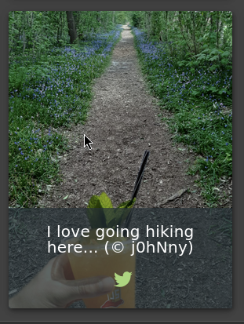

# Juice Shop Master Metadata Geo stalking

This documentation provides information on how you can abuse the security question system. Through Meta Geo stalking you could be able to reset a users password.

import GithubLinkAdmonition from '@site/src/components/GithubLinkAdmonition';

<GithubLinkAdmonition 
    link="https://github.com/FlyingChris1/my-dso-blog"
    title="Disclaimer" 
    type="tip"
>
This documentation is for teaching porpuses only and not ment to be used for ilegal porpuses!
</GithubLinkAdmonition>

## Table of Contents

- [Prerequisites](#prerequisites)
- [Quickstart](#Quickstart)


## Prerequisites

- Up and running OWASP Juice Shop
- Kali Linux
- Knowing the users email (possible through other exploits)

## Quickstart

1. Go to the the photo wall and finde Johns post

2. right click and save the file to a path of your choice



3. Enter the terminal and go the path where the file is stored

```bash
Ctrl + Alt + T
cd <path to the file>
```

4. Reveal the metadata of the file

```bash
exiftool <file name>
```

5. Enter the gps position in google maps and find his favorite hiking place

```bash
https://www.google.com/maps/place/36°57'31.4"N+84°20'53.6"W
```


6. Reset his password with the security question


import DocCardList from '@theme/DocCardList';

<DocCardList/>